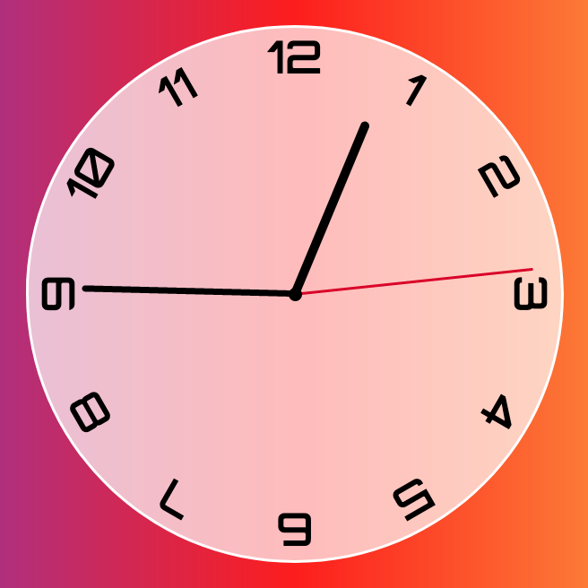

# analog-clock
A responsive analog clock to remember the old pass times. 
Built with html css and js.
The interesting things about this project is the css style, using position and transform property.

